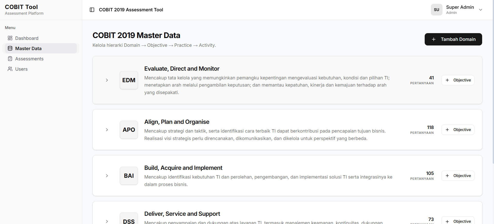
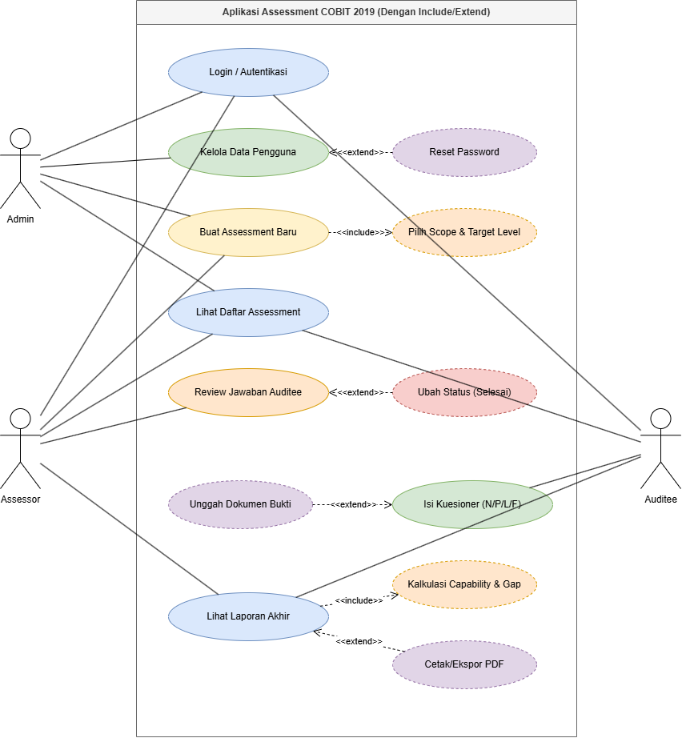
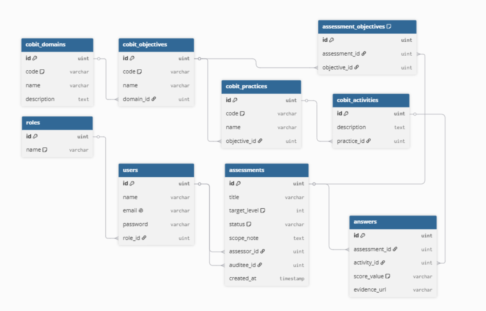

# COBIT 2019 Assessment Tool

Platform evaluasi dan penilaian tingkat kematangan tata kelola teknologi informasi (IT Governance) berbasis *framework* COBIT 2019. Aplikasi ini dirancang untuk memfasilitasi konsultan TI/Auditor (*Assessor*) dan entitas yang diaudit (*Auditee*) dalam melakukan penilaian *capability level* dengan antarmuka yang modern, dinamis, dan terstruktur.

## 🚀 Fitur Utama

- **Role-Based Access Control (RBAC):** Pemisahan hak akses yang jelas secara *Frontend* dan *Backend* antara **Admin** (Pengelola Data), **Assessor** (Auditor/Konsultan), dan **Auditee** (Klien/Responden).
- **Dynamic Assessment Scope:** Assessor dapat membuat proyek asesmen baru, mendefinisikan auditee, dan menentukan ruang lingkup (*scope*) audit dengan memilih spesifik *COBIT Objectives* (Misal: EDM01, APO02) serta mengatur *Target Level* yang diharapkan.
- **Standar Penilaian N/P/L/F:** Menggunakan kalkulasi rasio pencapaian resmi COBIT 2019:
  - **N** (*Not achieved* / 0-15%)
  - **P** (*Partially achieved* / >15-50%)
  - **L** (*Largely achieved* / >50-85%)
  - **F** (*Fully achieved* / >85-100%)
- **Attachment Bukti Audit (Evidence):** Auditee difasilitasi untuk mengunggah tautan dokumen bukti (seperti Google Drive/OneDrive) untuk memvalidasi setiap jawaban yang diberikan.
- **Kalkulasi & Pelaporan Otomatis:** Sistem secara otomatis mengkonversi skala N/P/L/F menjadi skor persentase numerik, menyajikan tingkat kematangan aktual (*As-Is Capability Level*), dan visualisasi *Gap Analysis* terhadap level target.
- **Data Terlindungi (Completed State):** Setelah Assessor memvalidasi laporan akhir dan menandai asesmen sebagai "Selesai" (*Completed*), sistem secara otomatis mengunci seluruh form. Auditee kehilangan akses tulis (*read-only state*) agar integritas laporan terjaga.

## 🛠️ Teknologi yang Digunakan

**Frontend:**
- [React.js](https://reactjs.org/) dengan [TypeScript](https://www.typescriptlang.org/)
- [Vite](https://vitejs.dev/) (Build tool super cepat)
- [Tailwind CSS](https://tailwindcss.com/) & [shadcn/ui](https://ui.shadcn.com/) (Menghasilkan UI/UX premium yang bersih, profesional, dengan *glassmorphism* dan tombol berukuran optimal)
- [Lucide React](https://lucide.dev/) (Pustaka Ikon modern)

**Backend:**
- [Golang](https://golang.org/) (Go)
- [Go Fiber](https://gofiber.io/) (Web Framework *high-performance*)
- [GORM](https://gorm.io/) (ORM Library yang sangat fleksibel)
- [PostgreSQL](https://www.postgresql.org/) (Sistem Manajemen Basis Data Relasional berbasis *enterprise-grade*)

---

## 🏗️ Arsitektur & Alur Sistem

### 1. Use Case Diagram
Menggambarkan interaksi alur bisnis (beserta relasi *include* dan *extend*) yang diizinkan untuk Admin, Assessor, dan Auditee terhadap fungsionalitas sistem.

### 2. Class Diagram (Database Entity-Relationship)
Struktur basis data relasional (*schema*) yang menopang master data hierarki tata kelola COBIT 2019 (*Domain -> Objective -> Practice -> Activity*) dan proses pivot asesmen secara persisten.

---
