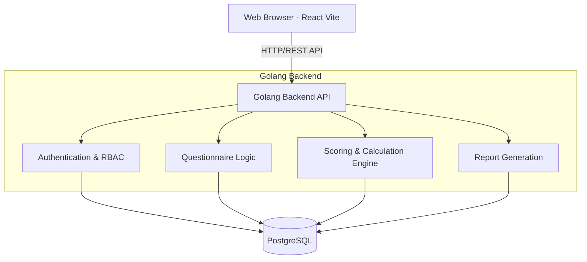

# Arsitektur Sistem: COBIT 2019 Assessment Tool

Dokumen ini menjelaskan arsitektur teknis tingkat tinggi (High-Level Architecture) untuk pengembangan aplikasi COBIT 2019 Assessment Tool.

## 1. Tumpukan Teknologi (Tech Stack)

Berdasarkan keputusan proyek, sistem akan dibangun menggunakan pendekatan *Decoupled Architecture* (Pemisahan antara Frontend dan Backend) dengan tumpukan teknologi berikut:

### Frontend (Client-Side)
*   **Framework:** React.js
*   **Build Tool:** Vite (untuk performa *build* dan *hot-module replacement* yang sangat cepat)
*   **Routing:** React Router (untuk navigasi *Single Page Application*)
*   **State Management:** Context API atau Zustand (untuk manajemen *state* ringan)
*   **HTTP Client:** Axios atau Fetch API (untuk komunikasi dengan REST API)
*   **Visualisasi Data:** Recharts atau Chart.js (untuk merender *Radar Chart* As-Is vs To-Be)
*   **Styling:** Vanilla CSS / CSS Modules (atau Tailwind CSS jika dikonfigurasi nanti)

### Backend (Server-Side)
*   **Bahasa Pemrograman:** Golang (Go)
*   **Web Framework:** Gin, Fiber, atau Echo (Direkomendasikan **Fiber** atau **Gin** untuk RESTful API yang cepat)
*   **Arsitektur Kode:** *Clean Architecture* atau *Layered Architecture* (Handler/Controller -> Service/Usecase -> Repository)
*   **Authentication:** JWT (JSON Web Tokens) untuk manajemen sesi dan *Role-Based Access Control* (RBAC)

### Database
*   **RDBMS:** PostgreSQL atau MySQL (Direkomendasikan **PostgreSQL** karena sangat baik untuk relasi hierarkis kompleks seperti COBIT)
*   **ORM / Query Builder:** GORM atau sqlx

## 2. Diagram Arsitektur (High-Level)



## 3. Struktur Direktori Proyek (Usulan)

Proyek akan dibagi menjadi dua direktori utama (atau repositori terpisah):

```text
me-tools-cobit2019/
│
├── frontend/                 # React + Vite Application
│   ├── src/
│   │   ├── assets/           # Gambar, CSS global
│   │   ├── components/       # Komponen UI yang dapat digunakan kembali (Tombol, Card)
│   │   ├── pages/            # Halaman utama (Dashboard, Kuesioner, Laporan)
│   │   ├── services/         # Pemanggilan API menggunakan Axios
│   │   ├── store/            # Manajemen State
│   │   └── utils/            # Fungsi utilitas (misal: format tanggal, kalkulasi UI)
│   ├── package.json
│   └── vite.config.js
│
├── backend/                  # Golang Application
│   ├── cmd/                  # Titik masuk (main.go)
│   ├── internal/             # Kode internal aplikasi
│   │   ├── config/           # Konfigurasi environment (DB, JWT)
│   │   ├── handler/          # HTTP Handlers (Controllers)
│   │   ├── middleware/       # Middleware (Auth, Logger, CORS)
│   │   ├── model/            # Definisi struktur data (Structs)
│   │   ├── repository/       # Interaksi dengan Database (SQL queries)
│   │   └── service/          # Logika bisnis (Kalkulasi skor COBIT)
│   ├── pkg/                  # Paket publik/utilitas (Hashing, JWT generator)
│   ├── go.mod
│   └── go.sum
│
└── brd.md                    # Business Requirement Document
```

## 4. Alur Data Utama (Data Flow)

1.  **Otentikasi:** Pengguna masuk (login) via Frontend. Backend (Go) memvalidasi kredensial di DB dan mengembalikan token JWT.
2.  **Manajemen Master Data (Admin):** Admin menggunakan Frontend untuk membuat/mengubah Domain, Objective, dan Activity COBIT. Frontend mengirim JSON payload ke API Go, yang kemudian menyimpannya di DB.
3.  **Pengisian Kuesioner (Auditee):** Auditee meminta kuesioner. Backend mengambil struktur hierarki COBIT dari DB dan mengirimkannya sebagai respons JSON. Auditee mengisi, dan hasil dikirim kembali ke API `POST /api/assessments`.
4.  **Kalkulasi (Backend):** Service Golang menerima jawaban (N-P-L-F), mengubahnya ke bobot angka, menghitung rata-rata untuk Capability Level, dan menyimpan skor akhir ke DB.
5.  **Pelaporan (Assessor/Auditor):** Frontend memanggil API laporan. Backend mengagregasi data dari DB, lalu Frontend mengubah JSON tersebut menjadi visualisasi *Radar Chart*.
